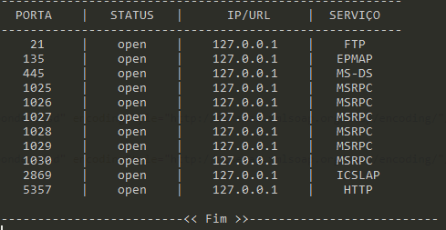
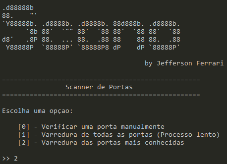

# Scanner de Portas TCP/IP em Python

Esse é um script escrito em python. Ele varre as portas de um determinado ip e exibe na tela as portas abertas.

exemplo da resposta do script

## Comandos:

* **-a** -> Nesse comando você vai especificar o alvo(ip)
* **-s** -> Com esse comando voê tem a opção de salvar os resultados em arquivo de texto. Escreva [ **--s 1**] para salvar.

Veja um exemplo de um comando abaixo:

## Opções

Depois de executar o comando acima, irá aparecer no terminal uma espécie de "menu". Veja abaixo um exemplo.

Basta escolher a opção da sua preferência e Let's go.

Esse script foi todo criado por mim
